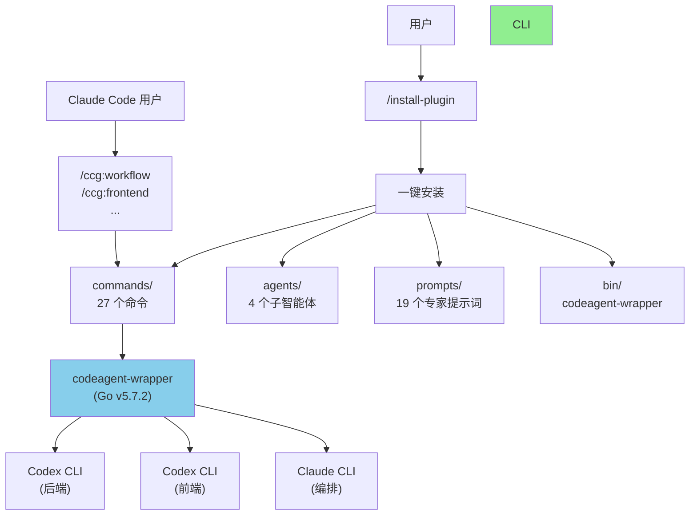
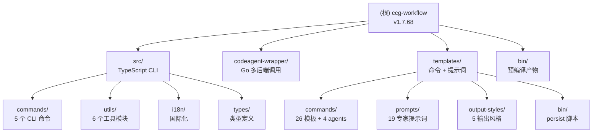

# CCG Multi-Model Collaboration System (ccg-workflow)

**Last Updated**: 2026-03-08 (v1.7.68)

---

## 变更记录 (Changelog)

> 完整变更历史请查看 [CHANGELOG.md](./CHANGELOG.md)

### 2026-03-08 (v1.7.68 - upstream 合并 + 适配)
- 合并 upstream 5 个提交：MCP skip 修复、OpenSpec 1.2 适配、spec-research 并行调用补全
- 测试体系：新增 vitest（34 单元 + 12 E2E = 46 个测试），覆盖 skip/fast-context/ace-tool
- 适配改造：所有模板 Gemini 引用替换为 Codex-B，默认 provider 改为 fast-context

### 2026-02-25 (插件集成 + manage 命令)
- 新增 `/ccg:manage` 主Agent调度命令（自动化编排 + planning-with-files 状态管理）
- `debug.md` 集成 sequential-thinking 结构化假设推理
- `plan.md` 集成 sequential-thinking 需求分解
- `review.md` 集成 comprehensive-review 三维本地审查（架构+安全+代码质量）
- 命令模板统计：26 -> 27 个

### 2026-02-25 (架构扫描更新)
- 全仓重新扫描，更新文件统计与模块覆盖率
- 新增模块级 CLAUDE.md：`codeagent-wrapper/CLAUDE.md`、`src/CLAUDE.md`、`templates/CLAUDE.md`
- 更新专家提示词统计：12 -> 19 个（Codex 6 + Gemini 7 + Claude 6）
- 更新命令模板统计：25 -> 26 个（含 enhance）
- 新增 `.claude/index.json` 覆盖率报告与缺口分析
- 新增 `persist.go` 输出持久化模块记录

### 2026-02-10 (v1.7.60)
- Agent Teams 系列：新增 4 个独立命令（`team-research`/`team-plan`/`team-exec`/`team-review`）
- 并行实施：利用 Claude Code Agent Teams spawn Builder teammates 并行写代码
- 完整链路：需求->约束 -> 消除歧义->计划 -> 并行实施 -> 双模型审查
- 完全独立：Team 系列不依赖现有 ccg 命令，自成体系

### 2026-02-08 (v1.7.57)
- MCP 工具扩展：新增 fast-context（推荐）+ 辅助工具（Context7/Playwright/DeepWiki/Exa）
- API 配置：初始化和菜单新增 API 配置，自动添加优化配置和权限白名单
- 实用工具：新增 ccusage（用量分析）+ CCometixLine（状态栏）
- Claude Code 安装：支持 npm/homebrew/curl/powershell/cmd 多种方式

### 2026-01-26 (v1.7.52)
- OpenSpec 升级：迁移到 OPSX 架构，废弃 `/openspec:xxx`，启用 `/opsx:xxx`
- 命令更新：更新 `spec-*` 系列命令以支持新的 `/opsx` 命令

### 2026-01-25 (v1.7.51)
- 修复默认语言为英文的问题：将 CLI 所有命令描述从硬编码英文改为中文

### 2026-01-21 (v1.7.47)
- 修复 `gemini/architect.md` 缺失：新增前端架构师角色提示词
- 专家提示词数量：12 -> 13 个（Codex 6 + Gemini 7）

---

## 项目愿景

**CCG (Claude + Codex)** 是一个多模型协作开发系统，以 Claude Code 为编排中心，通过 Codex 双视角（逻辑 + 架构）实现多模型协作的最佳开发体验。以 Claude Code Plugin 形式分发，用户通过 `/install-plugin` 一键安装 27 个斜杠命令 + 19 个专家提示词，即可使用 `/ccg:xxx` 命令。

---

## 架构总览



---

## 模块结构图



---

## 模块索引

| 模块 | 路径 | 语言 | 职责 | 文档 |
|------|------|------|------|------|
| CLI Tool | `src/` | TypeScript | 交互式安装/配置/更新/诊断 | [src/CLAUDE.md](./src/CLAUDE.md) |
| codeagent-wrapper | `codeagent-wrapper/` | Go | 多后端调用工具（codex/gemini/claude） | [codeagent-wrapper/CLAUDE.md](./codeagent-wrapper/CLAUDE.md) |
| Templates | `templates/` | Markdown | 26 命令模板 + 19 专家提示词 + 5 输出风格 | [templates/CLAUDE.md](./templates/CLAUDE.md) |
| Precompiled Binaries | `bin/` | Binary | 6 平台预编译 + 1 入口脚本 | (二进制，无文档) |

---

## 运行与开发

### 用户安装（插件模式）

在 Claude Code 中执行：
```
/install-plugin https://github.com/13210541230/ccg-plugin.git
```

更新插件：
```
/plugin update
```

### 开发模式

```bash
# 安装依赖
pnpm install

# 开发运行
pnpm dev

# 类型检查
pnpm typecheck

# 代码检查
pnpm lint
pnpm lint:fix

# 构建
pnpm build
```

### Go 模块

```bash
cd codeagent-wrapper

# 运行测试
go test ./...

# 跨平台编译
bash build-all.sh
```

---

## 对外接口

### Slash Commands 接口（27 个命令）

**开发工作流（12 个）**:

| 命令 | 用途 | 模型 |
|------|------|------|
| `/ccg:workflow` | 完整 6 阶段工作流 | Codex + Codex |
| `/ccg:plan` | 多模型协作规划（Phase 1-2） | Codex + Codex |
| `/ccg:execute` | 多模型协作执行（Phase 3-5） | Codex + Claude |
| `/ccg:frontend` | 前端专项（快速模式） | Codex |
| `/ccg:backend` | 后端专项（快速模式） | Codex |
| `/ccg:feat` | 智能功能开发 | 规划 + 实施 |
| `/ccg:analyze` | 技术分析（仅分析） | Codex + Codex |
| `/ccg:debug` | 问题诊断 + 修复 | Codex + Codex |
| `/ccg:optimize` | 性能优化 | Codex + Codex |
| `/ccg:test` | 测试生成 | 智能路由 |
| `/ccg:review` | 代码审查（自动 git diff） | Codex + Codex |
| `/ccg:manage` | 主Agent调度（自动化编排） | sequential-thinking + comprehensive-review |

**Prompt 工具（1 个）**:

| 命令 | 用途 |
|------|------|
| `/ccg:enhance` | ace-tool Prompt 增强 |

**项目管理（1 个）**:

| 命令 | 用途 |
|------|------|
| `/ccg:init` | 初始化项目 CLAUDE.md |

**Git 工具（4 个）**:

| 命令 | 用途 |
|------|------|
| `/ccg:commit` | 智能提交（conventional commit） |
| `/ccg:rollback` | 交互式回滚 |
| `/ccg:clean-branches` | 清理已合并分支 |
| `/ccg:worktree` | Worktree 管理 |

**OpenSpec 系列（5 个）**:

| 命令 | 用途 |
|------|------|
| `/ccg:spec-init` | OpenSpec 初始化 |
| `/ccg:spec-research` | 需求研究 -> 约束集 |
| `/ccg:spec-plan` | 多模型分析 -> 零决策计划 |
| `/ccg:spec-impl` | 规范驱动实现 |
| `/ccg:spec-review` | 归档前双模型审查 |

**Agent Teams 并行实施（4 个）**（v1.7.60+，需 `CLAUDE_CODE_EXPERIMENTAL_AGENT_TEAMS=1`）:

| 命令 | 用途 | 说明 |
|------|------|------|
| `/ccg:team-research` | 需求 -> 约束集 | 并行探索代码库，双 Codex 分析 |
| `/ccg:team-plan` | 约束 -> 并行计划 | 消除歧义，拆分为文件范围隔离的独立子任务 |
| `/ccg:team-exec` | 并行实施 | spawn Builder teammates 并行写代码 |
| `/ccg:team-review` | 双模型审查 | 双 Codex 交叉审查 |

---

## 固定配置

v1.7.0 起，以下配置不再支持自定义：

| 项目 | 固定值 | 原因 |
|------|--------|------|
| 语言 | 中文 | 所有模板为中文 |
| 前端模型 | Codex | 双 Codex 架构 |
| 后端模型 | Codex（默认），可通过 CCG_BACKEND=claude 切换 | 擅长逻辑/算法/调试 |
| 协作模式 | smart | 最佳实践 |
| 命令数量 | 27 个 | 全部安装 |

---

## 测试策略

| 模块 | 测试情况 |
|------|----------|
| `codeagent-wrapper/` (Go) | 16 个测试文件，覆盖核心逻辑、并发、压力测试、基准测试 |
| `src/` (TypeScript) | 46 个测试（34 单元 + 12 E2E），vitest |
| `templates/` (Markdown) | 无自动化测试；通过安装流程间接验证 |

---

## 编码规范

- **TypeScript**: `@antfu/eslint-config`，ESNext target，strict mode
- **Go**: 标准 Go 格式（gofmt），纯标准库无外部依赖
- **Markdown**: 命令模板使用 `---` frontmatter 描述用途
- **构建**: unbuild（TypeScript）、`go build`（Go）

---

## 关键依赖与配置

### TypeScript 依赖

**运行时**: `cac` / `inquirer` / `ora` / `ansis` / `fs-extra` / `smol-toml` / `i18next` / `i18next-fs-backend` / `pathe`

**开发**: `typescript` / `unbuild` / `tsx` / `eslint` / `@antfu/eslint-config`

### Go 依赖

- Go 1.21+，纯标准库（无第三方依赖）

### 配置文件路径

| 文件 | 用途 |
|------|------|
| `~/.claude/.ccg/config.toml` | CCG 主配置 |
| `~/.claude.json` | Claude Code MCP 服务配置 |
| `~/.claude/settings.json` | Claude Code 设置（API/权限/状态栏） |

---

## 相关文件清单

### 核心源码

```
src/
+-- cli.ts                     # CLI 入口
+-- cli-setup.ts               # 命令注册
+-- index.ts                   # 库导出
+-- commands/
|   +-- init.ts                # 初始化命令
|   +-- update.ts              # 更新命令
|   +-- menu.ts                # 交互式菜单
|   +-- config-mcp.ts          # MCP 配置
|   +-- diagnose-mcp.ts        # MCP 诊断
+-- utils/
|   +-- installer.ts           # 安装逻辑（核心）
|   +-- config.ts              # 配置管理
|   +-- mcp.ts                 # MCP 工具集成
|   +-- platform.ts            # 跨平台工具
|   +-- version.ts             # 版本管理
|   +-- migration.ts           # 数据迁移
+-- i18n/
|   +-- index.ts               # 国际化
+-- types/
    +-- index.ts               # 类型定义
    +-- cli.ts                 # CLI 类型
```

### Go 模块

```
codeagent-wrapper/
+-- main.go                    # 入口
+-- config.go                  # 配置解析
+-- backend.go                 # 后端接口
+-- executor.go                # 执行引擎
+-- parser.go                  # JSON Stream 解析
+-- logger.go                  # 日志系统
+-- server.go                  # SSE WebServer
+-- filter.go                  # stderr 过滤
+-- utils.go                   # 工具函数
+-- persist.go                 # 输出持久化
+-- ... (16 test files)
```

### 模板文件

```
templates/
+-- commands/                  # 26 个斜杠命令
+-- commands/agents/           # 4 个子智能体
+-- prompts/codex/             # 6 个 Codex 提示词
+-- prompts/gemini/            # 7 个 Gemini 提示词
+-- prompts/claude/            # 6 个 Claude 提示词
+-- output-styles/             # 5 个输出风格
+-- bin/codeagent-persist.sh   # 持久化脚本
```

### 预编译产物

```
bin/
+-- ccg.mjs                           # CLI 入口脚本
+-- codeagent-wrapper-darwin-amd64     # macOS Intel
+-- codeagent-wrapper-darwin-arm64     # macOS Apple Silicon
+-- codeagent-wrapper-linux-amd64      # Linux x64
+-- codeagent-wrapper-linux-arm64      # Linux ARM64
+-- codeagent-wrapper-windows-amd64.exe # Windows x64
+-- codeagent-wrapper-windows-arm64.exe # Windows ARM64
```

---

## AI 使用指引

- 使用 `/ccg:workflow` 进行完整 6 阶段开发工作流
- 使用 `/ccg:plan` + `/ccg:execute` 分步执行规划和实施
- 前端任务用 `/ccg:frontend`（路由到 Codex）
- 后端任务用 `/ccg:backend`（路由到 Codex）
- Agent Teams 系列需先启用 `CLAUDE_CODE_EXPERIMENTAL_AGENT_TEAMS=1`
- 代码审查无参数时自动审查 `git diff`

---

## 发版规则（必须严格遵守）

每次发版必须完成以下所有步骤，缺一不可：

### 1. 更新版本号
- 编辑 `package.json` 中的 `version` 字段

### 2. 更新 CHANGELOG.md
- 在顶部添加新版本条目
- 格式：`## [x.y.z] - YYYY-MM-DD`

### 3. 更新 README.md
- 更新命令表（如有新增命令）
- 更新底部版本号

### 4. 更新 CLAUDE.md
- 更新顶部 `Last Updated` 日期和版本号
- 添加变更记录条目
- 更新命令数量、接口表等受影响的章节

### 5. 构建 + 同步插件 + 推送

使用 release 技能自动化（详见 `.claude/skills/release/`）：

```bash
bash .claude/skills/release/scripts/release.sh x.y.z
```

脚本自动完成：更新版本号 → 构建插件 → 运行测试 → 同步到 ccg-plugin → 推送 ccg-plugin

然后手动提交 ccg-workflow：
```bash
git add -A
git commit -m "chore: bump version to x.y.z"
git push origin main
```

### 检查清单
- [ ] package.json 版本号已更新
- [ ] CHANGELOG.md 已添加新版本条目
- [ ] README.md 已更新
- [ ] CLAUDE.md 已更新
- [ ] 插件构建通过（`node scripts/build-plugin.mjs`）
- [ ] 测试通过（`npx vitest run`）
- [ ] ccg-plugin 已推送
- [ ] ccg-workflow 已推送

---

**扫描覆盖率**: 98%+
**最后更新**: 2026-02-25
